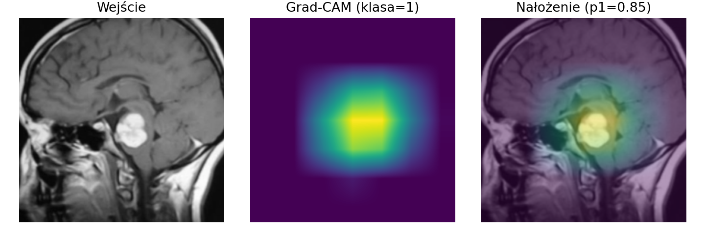
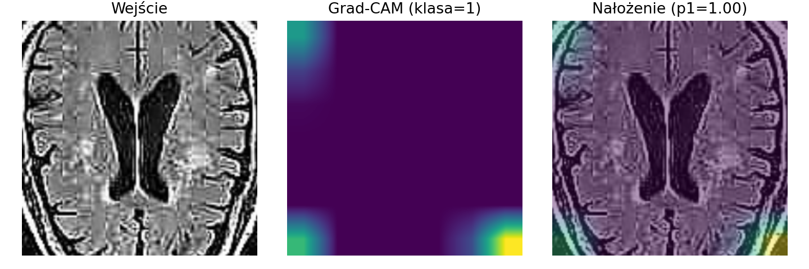
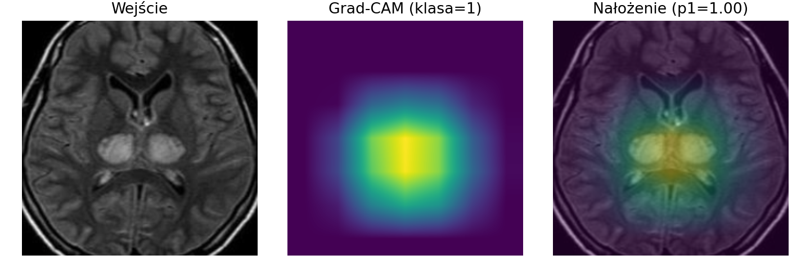
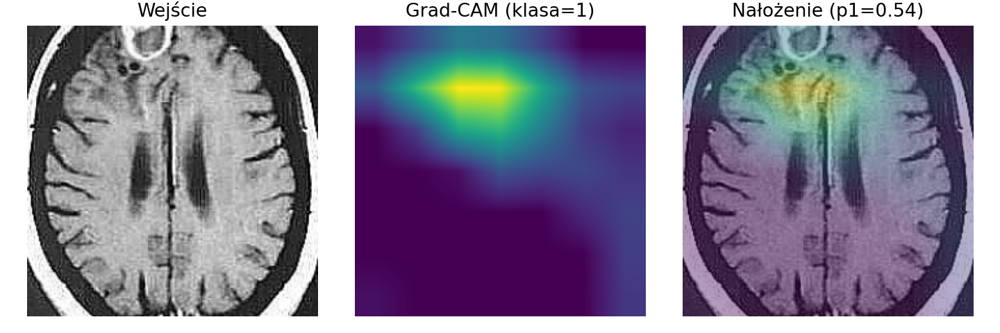

# 🧠 Brain Tumor Classification from MRI Images using ResNet-18

## 📄 Project Overview

Magnetic Resonance Imaging (MRI) plays a crucial role in the diagnosis of brain tumors.  
The goal of this project is to develop a **deep learning model based on the ResNet-18 convolutional neural network** capable of performing **binary classification** of MRI brain images — detecting whether a tumor is present (`tumor`) or not (`no tumor`).

This project is part of a master’s thesis focused on the application of deep learning in medical image analysis.  
The study investigates the impact of image preprocessing and augmentation on model performance and evaluates classification accuracy, sensitivity, and other relevant metrics.

---

## 🧰 Technologies Used

- **Python 3.10+**
- **PyTorch** – implementation and training of the ResNet-18 model  
- **Torchvision** – data loading and image augmentation  
- **scikit-learn** – evaluation metrics (accuracy, precision, recall, F1-score)  
- **Matplotlib** & **Seaborn** – visualization of results (confusion matrix, performance charts)  
- **Jupyter Notebook** – interactive environment for experiments and analysis  

---

## 🧬 Dataset

The dataset used in this project is the **[Brain Tumor MRI Dataset](https://www.kaggle.com/datasets/preetviradiya/brian-tumor-dataset)** available on Kaggle.  
It contains MRI brain images divided into two categories:

- `yes` – MRI scans showing a brain tumor  
- `no` – MRI scans without a tumor  

Example images from the dataset:

| Tumor (Positive) | No Tumor (Negative) |
|:----------------:|:-------------------:|
|  |  |

---

## Model Architecture

The classification model is based on **ResNet-18**, a deep convolutional neural network that introduces *residual connections* to address the vanishing gradient problem.  
This allows the model to train deeper networks efficiently while maintaining high performance.

**Adaptations for this project include:**
- Modifying the first convolutional layer to accept grayscale MRI images  
- Applying data augmentation (rotations, flips, brightness/contrast changes)  
- Using **transfer learning** from a ResNet-18 pretrained on ImageNet  
- Fine-tuning the model for binary classification (`tumor` / `no tumor`)  

---

## 📊 Evaluation and Results

The model’s performance was evaluated using standard classification metrics:
- **Accuracy**
- **Precision**
- **Recall (Sensitivity)**
- **F1-score**

A confusion matrix was also generated to visualize classification performance.  
Below are representative examples of model predictions:

| True Positive | False Positive | True Negative | False Negative |
|:--------------:|:--------------:|:--------------:|:--------------:|
|  |  |  |  |
